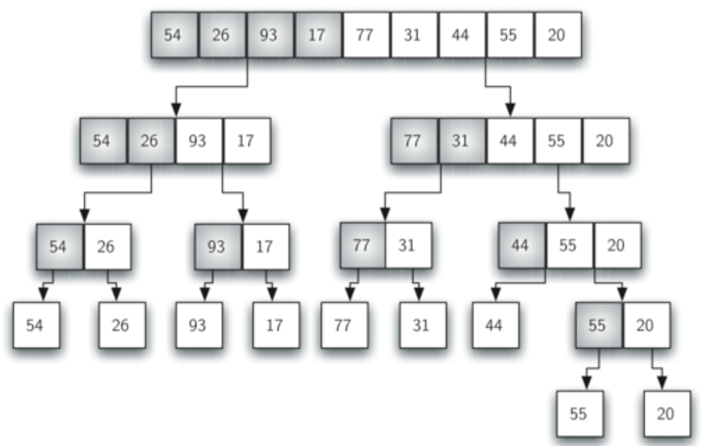
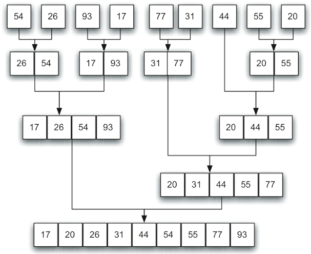

# algorithms
common software engineering algorithms written in python

# Pre-requisites
- python 3.6

# Installation Instructions
1. clone repo
```
git clone https://github.com/kulsuri/playground/tree/master/algorithms
```

# Running the App
- Run the command:
```
python test.py
```

# Searching Algorithms

## Linear Search
- Find an item in an UNORDERED list
- Start at the beginning of the list and continue searching until the end of the list is reached or the item is found
- O(n)

## Binary search
- Find an item in an ORDERED list
- Break the list in half. If the item you are searching for is above or below the middle then break that half of the list in half again. Continue this until the item is found.
- O( log(n) )

# Sorting Algorithms

## Merge Sort
- Split the list in half and recursively invokes a merge sort on both halves.
- Once two halves are sorted, a merge is performed – taking two smaller sorted lists and combining them together into a single, sorted, new list.
- O(n log n)

<!-- 
 -->

# Big O Time Complexity


Algorithm | Average Time Complexity |
--- | --- |
`linear search` | *O(n)* |
`binary search` | *O(log n)* |
`merge sort` | *O(n log n)* |